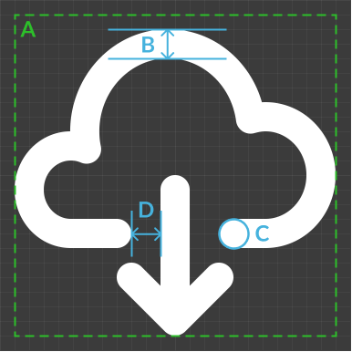

# @cohesic/react-icons

React icons for the Cohesic suite of products.

🔎 **[Preview the Icons Here](https://cohesic.github.io/react-icons/)**

📦 **[npm Package](https://www.npmjs.com/package/@cohesic/react-icons)**

## Installation & Use

```bash
npm i @cohesic/react-icons
```

Then use any of the exported icons in your code:

```tsx
import { ArrowLeft } from '@cohesic/react-icons'

function Component() {
  return (
    <a href="/">
      Back Home <ArrowLeft />
    </a>
  )
}
```

### Icon Color

All icons are configured to use the `currentColor` so they will match any custom styled links, buttons, etc.
An easy way to override this is by supplying a CSS class name to the component which sets the `color` directive.

For example, with `styled-components`:

```tsx
import { ArrowLeft } from '@cohesic/react-icons'
import styled from 'styled-components'

const RedArrowLeft = styled(ArrowLeft)`
  color: red;
`
```

Another example using CSS modules:

```tsx
import { ArrowLeft } from '@cohesic/react-icons'
import styles from './styles.css'

const RedArrowLeft = () => <ArrowLeft className={styles.redIcon} />
```

### Icon Size

The default size for each icon is `1em` but this can be overridden by supplying the `size` prop which accepts either a `number` (results in pixel size) or a `string`.

```tsx
import { ArrowLeft } from '@cohesic/react-icons'

const HugeArrowLeft = () => <ArrowLeft size="5rem" />
```

## Icon Authoring

Icons can be authored in any tool as long as they meet the following criteria:

1. It is authored to be 24 &times; 24 pixels in dimension
1. The `viewBox` is set to `0 0 24 24`
1. There are no `clipPath`, `filter`, or `mask` elements used (anything referenced by `id`) - this includes making any `defs`
1. There are no `script` or `style` tags used

Many of the disallowed tags and features are for simplicity when converting to a React component.
In order to avoid rendering issues, individual instances of an icon would need to generate their own unique set of IDs.
Beyond it being bad form to re-declare IDs, reusing them for things like `clipPath` or `mask` cause unintended behaviour because the IDs are global; often browsers will pick the last one defined.

While there exists a canonical set of these icons in a Figma file, it is currently not public.
For now, please make submissions as SVGs in a PR - the Figma file may become part of this repository in the future.

### Aesthetics

As with anything subjective the following are not rules but serve as highly recommended guidelines to help keep some consistency in the appearance of icons in the library.



✅ **Gutter (A)**

Try to maintain a 1px gutter around the icon. This avoids visual abutment issues when tightly packing icons next to other elements.

✅ **Pixel Grid Alignment (B)**

Straight lines that are either perfectly vertical or perfectly horizontal should always align to the pixel grid. Along with proper icon sizing, this makes the display of the icon crisp at all display resolutions and densities.
Therefore, all lines should be 2px in width with anchors at whole-pixel coordinates.
When possible, try to align to pixel coordinates that are multiples of 2; this way, lines will render as single pixel lines exactly on the grid if the icons are 12px in size.

It is advisable to also try to align to the pixel grid whenever a curved line's tangent becomes perfectly horizontal or vertical.
As with many aesthetic guidelines, there are always exceptions; in general, try to align to the grid whenever possible, but don't be afraid to disregard this guideline if the overall impression/appeal of the icon is improved by breaking from the grid.

✅ **Round Line Caps (C)**

All lines in icons should have rounded line caps.
Of course, for aesthetic reasons, this is not a hard rule as sometimes cutting a line with a hard edge simply looks better.
It is best to end lines so they align to the pixel grid (see above).
This makes for a nice, subtle tapering effect when rendered at the unit size (24px).

✅ **Overlap Cutouts (D)**

When shapes overlap, try to "cut out" the overlapped shapes around the overlapping shape with a gutter of 2px.

This is a rather loose guideline but it forms a non-trivial part of the overall style of the icons.
Sometimes a gutter of 1px will look better and sometimes no cutout at all is preferable.
The goal here is visual clarity; if by cutting out part of the overlapped shape the image reads more clearly, then use the cutout.

✅ **Visual Balance**

Not every icon can be merely centered within the viewBox and appear balanced.
Instead, try to use the "optical centre of mass" to centre the icon in the viewBox.
So, in practice, how do we do that?
In many ways it is similar to finding the [centroid](https://en.wikipedia.org/wiki/Centroid) but, for design, the ideal algorithm is really iteration/guess-and-check:

1. Select all the paths and shapes then move them around the viewBox in 1px increments until it _feels_ centred at the mass of the icon.
1. Render the icon in the UI and add it in buttons and alongside other icons; does it _feel_ balanced with respect to the other icons and elements?
1. Repeat (and, possibly, adjust the actual shapes to accommodate better balance).

## Development

This project is written entirely in TypeScript and uses `ts-node` to run scripts.

After cloning this repository, install the dependencies:

```bash
npm i
```

Once complete, you can build the library with the following command:

```bash
npm run build
```

Note that this will generate the `src/index.ts` file which is ignored from git.
The publishable package output can be found in `./dist`.
From within that directory, one can publish with:

```bash
npm publish
```

### Helpers

There is one helper script for dealing with Figma exports.
This script will rename files in the form `Name=ExampleIcon.svg` to `ExampleIcon.svg`; that is, it will remove the `Name=` prefix and overwrite an existing file with the updated name.
Because Figma component variants have their properties defined in the "layer" name, this is used in the canonical Figma file to name each icon within a single Icon component.
The result is that Figma will export these layer names when exporting those variants.

To use this, simply export the icon variants as SVG from Figma into `./src/icons`.
Once complete, run the following:

```bash
npm run figma
```
